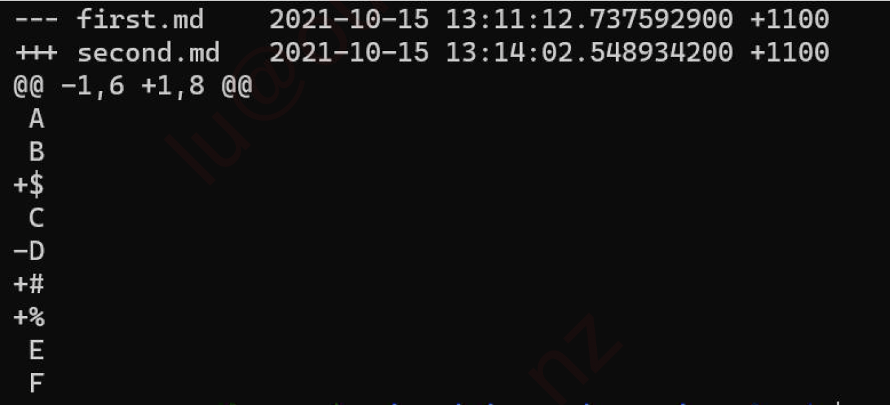

## Git简答作业

1\. Suppose you had a file, called `first.md`, and you made a copy of this file, named it `second.md` and made some changes to it. Next, suppose you ran `diff -u first.md second.md`.

Here is the content of the original `first.md`

`A`

`B`

`C`

`D`

`E`

`F`

Here is the output of the `diff` commmand:

What is the content of `second.md`?

**Answer:**

**`A`**

**`B`**

**`$`**

**`C`**

**`#`**

**`%`**

**`E`**

**`F`**

---

2\. (True or False) If you accidentally add a file to the staging area, you can remove it using `git reset`. For example, if you accidentally add `third.md`, but do not want it to be committed yet, run `git reset third.md` and the file will be removed from the staging area, **but it will still be in your working directory**.

**Answer:** 

**True. Running `git reset third.md` removes the file from the staging area but keeps it in the working directory.**

---

3\. (True or False) The commands `git reset` and `git revert` can only be used to undo commits in the git repository.

**Answer:** 

**False. `git reset` can be used to modify the staging area and working directory as well. `git revert` is used to undo commits by creating a new commit.**

---

4\. (True or False) The command `git checkout` can be used to roll back to a certain commit hash (check the documentation if you are unsure).

**Answer:**

**True. `git checkout <commit-hash>` allows you to move the HEAD to a specific commit.**

---

5\. (True or False) We cannot commit changes in the working directory directly to the repository without adding it to the staging index first (read the documentation if you are unsure).

**Answer:** 

**True. Git requires changes to be staged (added to the index) before they can be committed.**

---

6\. (True or False) `git log -p` and `git log` will give you the same output.

**Answer:**

**False. `git log -p` includes the patch information (differences in code), whereas `git log` shows a summary of commits.**

---

7\. (True or False) `git log --oneline` and `git log --stat` will give you the same output.

**Answer:**

**False. `git log --oneline` shows a concise one-line summary of each commit, whereas `git log --stat` provides statistics about changes made in each commit.**

---

8\. (True or False) It is recommended that in most cases we should use `git revert` rather than `git reset` to undo commits because `git revert` is safer.

**Answer:**

**True. `git revert` creates a new commit to undo changes, preserving the history, whereas `git reset` rewrites history, which can be unsafe in collaborative environments.**